# Google Chat Bot Architecture

This document contains the architecture diagrams and documentation for the Google Chat Bot system.

## Architecture Overview

The Google Chat Bot system is built on Google Cloud Platform and consists of multiple interconnected components including authentication services, AI processing, and automated deployment pipelines.

**Project**: `cte-dse-g-chat-bot-np-487b78` (Non-Production)

## Architecture Diagram

```mermaid
graph TB
    %% Define styling
    classDef userInterface fill:#FFF2CC,stroke:#D6B656,stroke-width:2px
    classDef authentication fill:#D5E8D4,stroke:#82B366,stroke-width:2px
    classDef coreProcessing fill:#E1D5E7,stroke:#9673A6,stroke-width:2px
    classDef aiServices fill:#DAE8FC,stroke:#6C8EBF,stroke-width:2px
    classDef storage fill:#F8CECC,stroke:#B85450,stroke-width:2px
    classDef infrastructure fill:#FFE6CC,stroke:#D79B00,stroke-width:2px
    classDef cicd fill:#E6F3FF,stroke:#4A90E2,stroke-width:2px
    classDef monitoring fill:#F0F0F0,stroke:#666666,stroke-width:2px

    %% User Interface Layer
    subgraph UI["👥 User Interface"]
        Users[👤 Users]
        GChat[💬 Google Chat<br/>Spaces/DMs]
    end

    %% Authentication Layer
    subgraph AUTH["🔐 Authentication & Authorization"]
        EAPAuth[🏢 EAP Chat Bot<br/>Auth Service<br/>eap-chat-bot-auth-np.cloudapps.telus.com]
        GoogleOAuth[🔑 Google OAuth 2.0]
        OAuthCreds[(🔐 OAuth Client<br/>Credentials)]
    end

    %% Core Processing
    subgraph CORE["⚙️ Core Chat Bot Processing"]
        ChatBot[🤖 Google Chat Bot<br/>Cloud Function]
        OAuthMgr[🔒 OAuth Manager]
        ChatMgr[💬 Chat Manager]
        LLMMgr[🧠 LLM Manager]
        MainHandler[⚡ Main Handler]
        PubSub[📨 Pub/Sub<br/>Message Queue]
        EventProc[🔄 Event Processing]
    end

    %% AI Services
    subgraph AI["🧠 AI & Knowledge Services"]
        VertexSearch[🔍 Vertex AI Search]
        LLMIntegration[🤖 LLM Integration<br/>OpenAI/etc]
        PromptMgmt[📝 Prompt Management]
        DocContext[(📚 Document Context)]
    end

    %% Storage
    subgraph STORAGE["💾 Storage & Secrets"]
        SecretMgr[(🔐 Google Secret Manager)]
        UserSecrets[👤 User Credentials<br/>secret-userid pattern]
        OAuthConfig[⚙️ OAuth Client Config]
        AppCreds[🔑 App Credentials]
        GCS[(☁️ Google Cloud Storage)]
        Datastore[(🗄️ Datastore)]
    end

    %% Infrastructure
    subgraph INFRA["🏗️ Infrastructure & Deployment"]
        GKE[☸️ Google Kubernetes Engine<br/>private-na-ne1-001]
        AuthPods[📦 EAP Auth Service<br/>Pods]
        Ingress[🌐 Ingress Controller<br/>nginx]
        LoadBalancer[⚖️ Cloud Load Balancer]
        ArtifactRegistry[📦 Artifact Registry]
    end

    %% CI/CD Pipeline
    subgraph CICD["🚀 CI/CD Pipeline"]
        GitHub[📁 GitHub Repository]
        GitHubActions[⚡ GitHub Actions<br/>Workflow]
        CloudBuild[🔨 Cloud Build<br/>Private Pool]
        CloudDeploy[🚀 Cloud Deploy<br/>Pipeline]
        Skaffold[📋 Skaffold<br/>Build Config]
        Helm[⚙️ Helm Charts]
    end

    %% Monitoring
    subgraph MONITORING["📊 Monitoring & Observability"]
        CloudLogging[📝 Cloud Logging]
        AppLogging[📋 Application Logging]
        ErrorTracking[🚨 Error Tracking]
        HealthMonitoring[❤️ Health Monitoring]
    end

    %% User Flow
    Users --> GChat
    GChat --> PubSub
    PubSub --> ChatBot
    ChatBot --> MainHandler

    %% OAuth Flow
    ChatBot --> OAuthMgr
    OAuthMgr --> SecretMgr
    OAuthMgr --> EAPAuth
    EAPAuth --> GoogleOAuth
    GoogleOAuth --> EAPAuth
    EAPAuth --> SecretMgr

    %% Message Processing Flow
    ChatBot --> ChatMgr
    ChatMgr --> VertexSearch
    VertexSearch --> DocContext
    ChatBot --> LLMMgr
    LLMMgr --> LLMIntegration
    LLMMgr --> PromptMgmt
    ChatBot --> GChat

    %% CI/CD Flow
    GitHub --> GitHubActions
    GitHubActions --> CloudBuild
    CloudBuild --> Skaffold
    Skaffold --> ArtifactRegistry
    CloudBuild --> CloudDeploy
    CloudDeploy --> Helm
    Helm --> GKE

    %% Infrastructure Connections
    LoadBalancer --> Ingress
    Ingress --> AuthPods
    AuthPods --> GKE
    EAPAuth --> SecretMgr
    ChatBot --> GCS
    ChatBot --> Datastore

    %% Secret Manager Internal
    SecretMgr --> UserSecrets
    SecretMgr --> OAuthConfig
    SecretMgr --> AppCreds

    %% Monitoring Connections
    ChatBot --> CloudLogging
    EAPAuth --> AppLogging
    GKE --> HealthMonitoring
    ChatBot --> ErrorTracking

    %% Apply styles
    class Users,GChat userInterface
    class EAPAuth,GoogleOAuth,OAuthCreds authentication
    class ChatBot,OAuthMgr,ChatMgr,LLMMgr,MainHandler,PubSub,EventProc coreProcessing
    class VertexSearch,LLMIntegration,PromptMgmt,DocContext aiServices
    class SecretMgr,UserSecrets,OAuthConfig,AppCreds,GCS,Datastore storage
    class GKE,AuthPods,Ingress,LoadBalancer,ArtifactRegistry infrastructure
    class GitHub,GitHubActions,CloudBuild,CloudDeploy,Skaffold,Helm cicd
    class CloudLogging,AppLogging,ErrorTracking,HealthMonitoring monitoring
```



## Key Components

### 🔐 Authentication Flow
1. **User Authentication**: Each user must individually authorize the bot via OAuth 2.0
2. **EAP Auth Service**: Kubernetes-deployed service handling OAuth flows
3. **Secret Management**: User-specific credentials stored with secret-userid pattern

### 🤖 Chat Bot Processing
1. **Event-Driven**: Triggered by Google Chat MESSAGE events via Pub/Sub
2. **AI Integration**: Uses Vertex AI Search and LLM for intelligent responses
3. **Thread Context**: Reads full conversation history for context-aware responses

### 🚀 CI/CD Pipeline
1. **GitHub Actions**: Automated deployment on code changes
2. **Cloud Build**: Container building with private worker pools
3. **Cloud Deploy**: Managed deployment to GKE clusters

## Available Diagram Formats

- **Mermaid Diagram**: [`architecture-diagram.mmd`](./architecture-diagram.mmd) - GitHub-native rendering
- **PlantUML Diagram**: [`architecture-diagram.puml`](./architecture-diagram.puml) - Professional UML format
- **Detailed Description**: [`architecture-description.md`](./architecture-description.md) - Comprehensive documentation

## Environment Details

- **Project**: `cte-dse-g-chat-bot-np-487b78`
- **GKE Cluster**: `private-na-ne1-001`
- **Auth Service**: `https://eap-chat-bot-auth-np.cloudapps.telus.com`
- **Region**: `northamerica-northeast1`

## Data Flows

### User Interaction
```
User → Google Chat → Pub/Sub → Chat Bot → AI Processing → Response
```

### OAuth Authentication
```
Chat Bot → EAP Auth Service → Google OAuth → Secret Manager
```

### CI/CD Deployment
```
GitHub → GitHub Actions → Cloud Build → Cloud Deploy → GKE


# SDK Codegen

This Looker Open Source repository is released under the MIT license. By using this repository, you agree to the terms of that license, and acknowledge that you are doing so at your own risk.

While Looker has developed and tested this code internally, we cannot guarantee that the open-source tools used by the scripts in this repository have not been modified with malicious code.

**Important** - If you are using the Looker TypeScript SDK, please see the [note at the bottom](#very-important-note-regarding-the-looker-typescript-sdk) of this file explaining changes to dependencies and packaging.

## Overview

This repository contains:

- The [SDK code generator](packages/sdk-codegen) that generates the source code for Looker SDKs
- Source code for the [Looker SDKs](#looker-sdks) produced by the code generator
- Looker SDK source code [examples](examples)
- the [API Explorer extension](packages/extension-api-explorer) that can be installed into a Looker instance
- the stand-alone [API Explorer](packages/api-explorer)
- the [RunIt](packages/run-it) REST client tester (embedded within API Explorer, typically)
- [code generator scripts](packages/sdk-codegen-scripts) that require Node (file i/o) to read and write SDK files

## The parts of the Looker SDK

We hope to help people who want to use Looker as a platform get up and running quickly, largely by providing pre-built client SDKs in the most popular languages, and implementing consistency across all languages and platforms.

The Looker SDK has several parts:

- The **Looker API**, described by an [OpenAPI specification](https://github.com/OAI/OpenAPI-Specification) (e.g., the Swagger 2.x representation found at
  `https://<your-looker-domain>:19999/api/4.0/swagger.json`). The 4.0 API is our current & stable API. As of June 2022, [3.x is deprecated](https://developers.looker.com/api/advanced-usage/version-3x-deprecation).

- The **Looker API Explorer**, an interactive reference, accessible either stand-alone at [developers.looker.com/api/explorer/](https://developers.looker.com/api/explorer/), or installable into your Looker instance as an extension from the Looker Marketplace.

- **Language SDKs**, "smarter" client language classes and methods to improve the experience of calling the Looker API in various popular coding languages. Some SDKs are [Looker-supported](https://docs.looker.com/reference/api-and-integration/api-sdk-support-policy#support_levels) whereas others are community-supported.

## SDK multi-API-version support

The 4.0 version of the API is the current and stable version of the API, in addition to the 3.x API which is now [deprecated](https://developers.looker.com/api/advanced-usage/version-3x-deprecation).

Some SDKs support and expose both API versions in the same SDK package, including all [Looker-supported SDKs](https://docs.looker.com/reference/api-and-integration/api-sdk-support-policy#language_sdks).

For SDKs that support multiple API versions, there will be `methods.*` and `models.*` collections generated for each API version. Each API version is exposed under a distinct class name from which to instantiate an initial SDK object.

API-version-specific files generally use shared Run-Time Library (RTL) code in the SDK package to minimize code duplication.

Regardless of which API version you use, API credentials are unchanged, and may continue to be referred to as "API3" credentials.


### Looker SDKs

Please review the following table for a breakdown of the options to initialize the desired SDK object.

| SDK                        | API 3.1 [(deprecated)](https://developers.looker.com/api/advanced-usage/version-3x-deprecation) | API 4.0                                                                  | Notes                                                                                                                                                                                                                                          |
| -------------------------- | ----------------------------------------------------------------------------------------------- | ------------------------------------------------------------------------ | ---------------------------------------------------------------------------------------------------------------------------------------------------------- |
| [Python](python)           | `looker_sdk.init31()`                                                                           | `looker_sdk.init40()`                                                    |                                                                                                                                                            |
| [TypeScript](packages/sdk) | `Looker31SDK()`, `LookerNodeSDK.init31()`, or `LookerBrowserSDK.init31()`                       | `Looker40SDK()`, `LookerNodeSDK.init40()` or `LookerBrowserSDK.init40()` | **Important** - See information on the [typescript SDK dependencies](#very-important-note-regarding-the-looker-typescript-sdk) at the bottom of this file. |
| [Kotlin](kotlin)           | Not supported                                                                                   | `LookerSDK()`                                                            | Community-supported SDK. Uses API 4.0 exclusively. The initializer uses an unversioned name.                                                               |
| [Swift](swift/looker)      | Not supported                                                                                   | `Looker40SDK()`                                                          | Community-supported SDK. Uses API 4.0 exclusively.                                                                                                         |
| [Look#](csharp)            | Not supported                                                                                   | `Looker40SDK()`                                                          | Community-supported SDK. Uses API 4.0 exclusively.                                                                                                         |
| [GoLook](go)               | Not supported                                                                                   | `v4.NewLookerSDK()`                                                      | Community-supported SDK. Uses API 4.0 exclusively.                                                                                                         |

By supporting both API versions in the same SDK package, we hope the migration path to the latest API is simplified. Both SDK versions can be used at the same time, in the same source file, which should allow for iterative work to move to the new API version.

For example:

```typescript
import {
  Looker40SDK,
  Looker31SDK,
  NodeSession,
  NodeSettingsIniFile,
} from '@looker/sdk'

const settings = new NodeSettingsIniFile()
const session = new NodeSession(settings)
const sdk = new Looker40SDK(session)
const sdk31 = new Looker31SDK(session)

const me40 = await sdk.ok(sdk.me())
const me31 = await sdk.ok(sdk31.me()) // or sdk31.ok(sdk31.me())
```

## Automatic URL encoding for input values

TL;DR: don't URL encode your inputs because the SDKs will automatically handle it.

All SDKs URL encode (also known as [percent encoding](https://en.wikipedia.org/wiki/Percent-encoding)) input values for passing to the API endpoints automatically. Furthermore, except for Swift, which has problematic URL decoding support, the other SDKs will avoid double-encoding inputs that may already be encoded.

## Using existing, pre-generated SDKs

When a specific language SDK has been developed, Looker makes that SDK available using the standard package manager for that platform. Currently, the [Python SDK](python) and the [TypeScript SDK](packages/sdk) can be installed from their respective package managers by following the instructions in their readmes.

For the other SDKs in this repository, you can copy and paste the source code into a module for your own project. Every SDK will eventually have a deployed package version.

If you want to use the generation options for an SDK, read on.

## Generating an API language binding

There are three steps for generating an SDK with this project:

- [configure a `looker.ini` file](#configuring-lookerini-or-env) so the Looker API specification can be retrieved from your Looker server.

  - **Note**: previous versions of the `looker.ini` file had an `api_version` entry. This is no longer required. The code generator project will read an `api_versions` value if that is found, but the SDKs ignore this value. If `api_versions` is not found in the `ini` file, it defaults to "3.1,4.0" for the generator to produce the definitions for the supported API versions.

- install the code generator project dependencies by running:

```sh
yarn install
yarn build
```

The resources required to run the code generator are in [package.json](package.json).

**Note**: If `yarn` is not installed, use [these instructions to install](https://yarnpkg.com/lang/en/docs/install/) it.

- run the SDK generator with `yarn gen [language]`

- **Note**: [Generating Client SDKs for the Looker API](https://discourse.looker.com/t/generating-client-sdks-for-the-looker-api/3185) describes the legacy, manual steps for generating an API language binding. This project replaces these manual steps, and uses an improved code generator.

## Configuring `looker.ini` or `.env`

The code generator and other scripts and tests read a configuration file called `looker.ini` to fetch the API specification from a server. This configuration file needs to be in the root folder of the code generator.

To create `looker.ini`, copy [`looker-sample.ini`](looker-sample.ini) to `looker.ini` and fill in the required values. The values for `client_id` and `client_secret` can be retrieved by navigating to `https://<your_looker_endpoint>/admin/users`, editing your user, editing API3 keys, and clicking the "reveal" button to view your `client_id` and `client_secret`. If there are currently no API3 credentials, they can be generated by clicking “New API3 Key.”

For your own source code repositories, be sure to configure your version control system to ignore the SDK configuration `.ini` file so it doesn't accidentally get published somewhere unauthorized people can see it.

Unlike some other OpenAPI code generators, the Looker SDK code generator **never** writes access information into SDK source code. All SDKs provided by Looker are designed to receive the credentials required to call API methods via a `readConfig()` method that returns a key/value collection, where `client_id` and `client_secret` are retrieved, and used only for the time it takes to complete a login for authentication token retrieval, then they are immediately discarded from memory.

**Note**: If a `.env` file is found, this will override values from `looker.ini`. To use a `.env` file for configuration instead, copy [`env-sample`](env-sample) to `.env` and provide the correct values for the environment variables.

Invoke the SDK code generator with the command:

```sh
yarn gen
```

To always use the latest Looker API specification for SDK generation, use:

```sh
yarn wipe && yarn gen
```

The code generator will:

- read the Looker API configuration(s) from the `looker.ini` file.

  - **Note**: Normally there should only be one (1) entry in `looker.ini`. This first ini section is what is used for the SDKs by default, and also by the code generator.

- download (if the API specification file is not already present) the Looker API specification file(s) from the configured Looker server(s)

- convert (if the converted file is not already present) the downloaded Swagger 2 specification file(s) to OpenAPI 3.x

- validate the OpenAPI 3.x file(s)

- by default, call the code generator for each active language 

  - To generate one specific language SDK, use `yarn gen {language}`. The supported languages have a factory declared in the `Generators` array in [`codeGenerators.ts`](packages/sdk-codegen/src/codeGenerators.ts)

When the generator completes successfully, the output will be similar to:

```plain-text
python
  looker
    rtl
      (run-time library hand-written files here)
    sdk
      methods.py (automatically generated)
      models.py (automatically generated)
```

**Note:** If you're unable to download the API specification file because you're using an instance of Looker that is self-signed and errors are thrown, you can explicitly turn off SSL verification by putting `verify_ssl=false` in the `looker.ini` file configuration section.

### Using the Legacy generator

To generate a language currently not supported by Looker's SDK code generator with the OpenAPI generator:

- configure the desired language in [`codeGenerators.ts`](packages/sdk-codegen/src/codeGenerators.ts).

- use `yarn legacy` to call the OpenAPI generator. This will use the OpenAPI generator to output files to the `./api/*` path

### Additional scripts

Use

```sh
yarn run
```

to see the list of all scripts that can be run by the code generator.

After generation, the generated code might not conform with the code standards.
Changes cannot be committed until they pass the lint tests.
This can be checked with the following:

```sh
yarn lint
```

For a faster run, only the modified files can be checked with any of these
commands:

```sh
yarn lint-changed
yarn lint -q
yarn lint --quick
```

Fixes can automagically be applied with one of the following:

```sh
yarn lint-changed-fix
yarn lint -q -f
yarn lint --quick --fix
```

## SDK Examples

The [examples directory](/examples) contains code snippets and projects written using the Looker language SDKs. You may find useful code in that repository. and are also welcome to contribute additional examples.

## API Troubleshooting

See the official documentation for [API Troubleshooting](https://docs.looker.com/reference/api-and-integration/api-troubleshooting) suggestions.

## Notes

In addition to swagger being deprecated, this [visual guide](https://blog.readme.io/an-example-filled-guide-to-swagger-3-2/) shows why OpenAPI 3.x is preferred to Swagger 2.x.

## Securing your SDK credentials

Looker improves on the security of the generated code for SDKs by **never** storing your server location or API credentials in the source code generated by the Looker code generator. The SDKs also provide some customizable support for providing API configuration values like server location and credentials to the SDK. In every Looker SDK, there is an overrideable method called `readConfig()` that can be customized to retrieve and return SDK configuration values from your preferred secure storage location.

Each Looker SDK has existing `readConfig()` examples that read from `.ini` files or environment variables. These are intended to support a quick start when developing with a Looker SDK. If a production environment prohibits secure use of `.ini` files or environment variables, another method of retrieving API configuration values is required. The API configuration retrieval function `readConfig()` can be overridden to support alternate storage scenarios.

Typically, `client_id` and `client_secret` are the only key values that will need to be dynamically retrieved from the `readConfig()` override method because the other configuration values are saved in memory by the initialized SDK client. In the near future, there will be additional authentication flows (such as OAuth) supported by Looker SDKs. The dynamic result that is returned by `readConfig()` can also be useful in those additional scenarios.

A short [TypeScript SDK example](https://github.com/looker-open-source/sdk-examples/blob/6f7b42891923a7430e0bb8341c7b5c567a2e1269/typescript/customConfigReader.ts#L15:L28) that customizes `readConfig()` is available in the SDK Examples repository.

There is also a Kotlin SDK unit test in this repository with a short example:

```kotlin
class MockSettings(contents: String) : ApiSettings(contents) {
    override fun readConfig(): Map<String, String> {
        return mapOf(
                "base_url" to baseUrl,
                "verify_ssl" to verifySSL.toString(),
                "timeout" to timeout.toString(),
                "headers" to headers.toString(),
                "client_id" to mockId,
                "client_secret" to mockSecret
        )
    }
}
```

Please consult with the security professionals in your organization to determine the best way to secure your credentials for your own Looker SDK usage.

### Warnings for using `.ini` files to configure the SDK

To streamline getting started with the Looker SDKs, support for reading SDK credentials from an `.ini` file is included as a simple method for providing access information (server url and API credentials) to the SDK. If the source code to your Looker SDK application is shared in a version control system, the `.ini` file should be ignored so it never gets inadvertently published.

If the SDK application using an `.ini` file is available publicly, download or viewing of this `.ini` file should also be prohibited by the server hosting the application.

### Warnings for using Environment variables to configure the SDK

If the host environment for a Looker SDK supports environment variables, the SDK can also read environment variables to retrieve the server url and API credentials. Environment variables could also be visible to intrusive malware that may penetrate your application, so this option for providing credentials should also be used with caution.

## Environment variable configuration

Environment variables can be used for any SDK runtime that supports reading environment variables. Environment variables can be used in the:

- **Node** version of the TypeScript/JavaScript Looker SDK
- Python SDK
- Swift SDK
- Kotlin SDK
- Go SDK

The following table describes the environment variables. By default, the SDK "namespace" is "LookerSDK" which is converted to UPPERCASE when used for naming environment variables.

| Variable name           | Description                                                                                                                                                           |
| ----------------------- | --------------------------------------------------------------------------------------------------------------------------------------------------------------------- |
| LOOKERSDK_BASE_URL      | A URL like `https://my.looker.com:19999`. No default value.                                                                                                           |
| LOOKERSDK_VERIFY_SSL    | `true`, `t`, `yes`, `y`, or `1` (case insensitive) to enable SSL verification. Any other value is treated as `false`. Defaults to `true` if not set.                  |
| LOOKERSDK_TIMEOUT       | Request timeout in seconds. Defaults to `120` for most platforms.                                                                                                     |
| LOOKERSDK_CLIENT_ID     | API3 credentials `client_id`. This and `client_secret` must be provided in some fashion to the Node SDK, or no calls to the API will be authorized. No default value. |
| LOOKERSDK_CLIENT_SECRET | API3 credentials `client_secret`. No default value.                                                                                                                   |

### Configuration variable precedence

Configuration variables should be processed as follows:

- if the default configuration `.ini` file exists, apply the values
- if an environment variable exists, apply the value
- if a configuration value is explicitly in code, apply that value
- if a command-line switch is supported, apply that value
